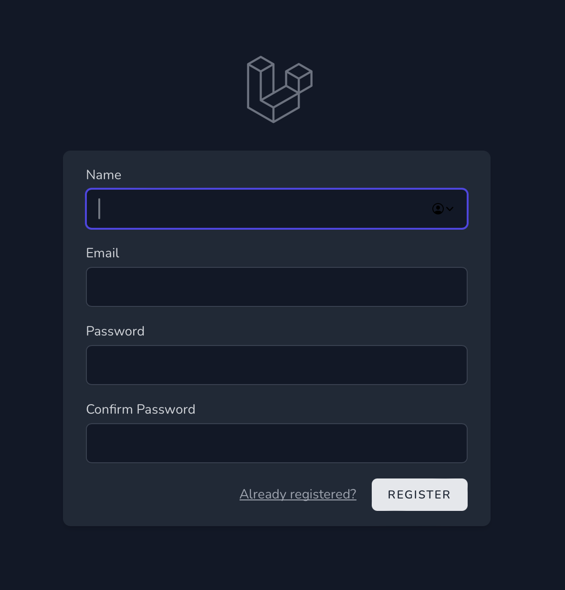
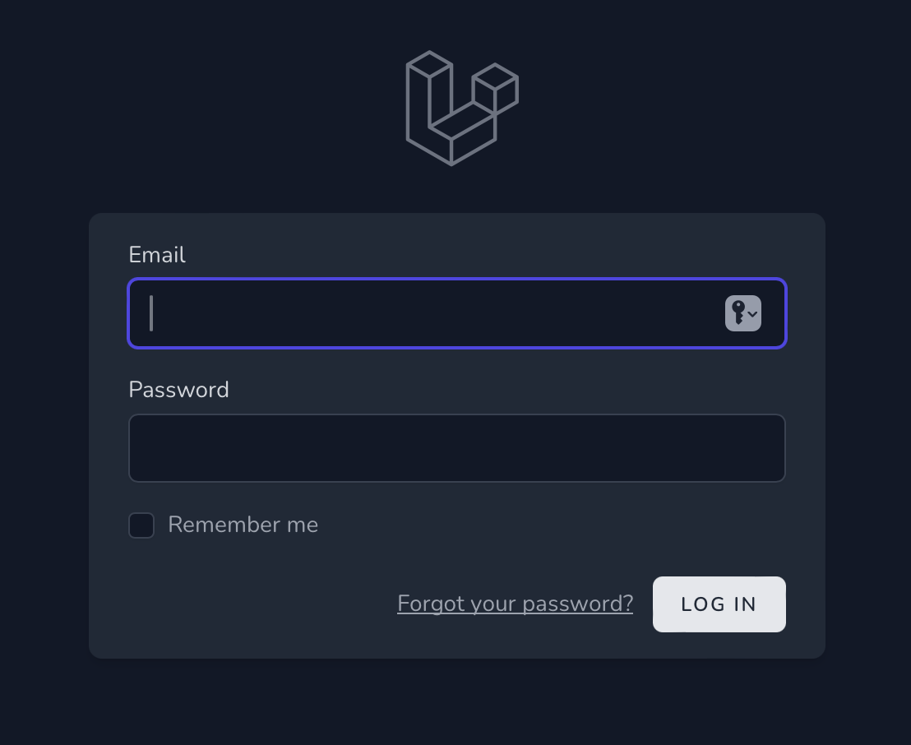
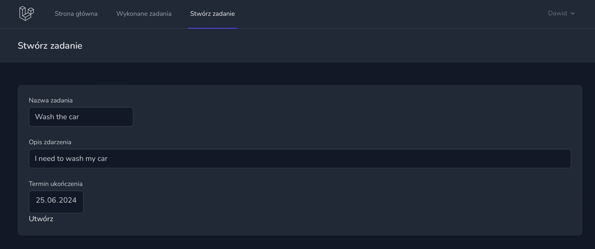
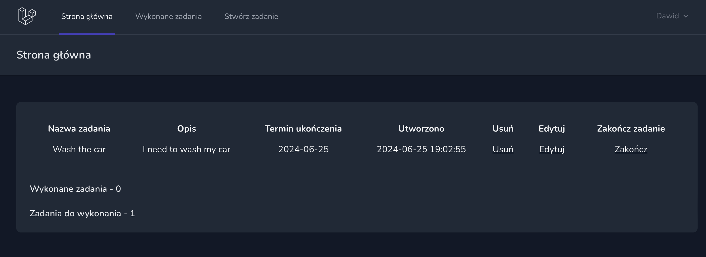
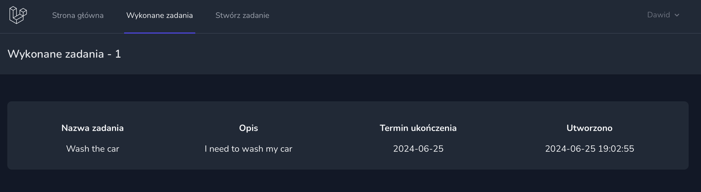
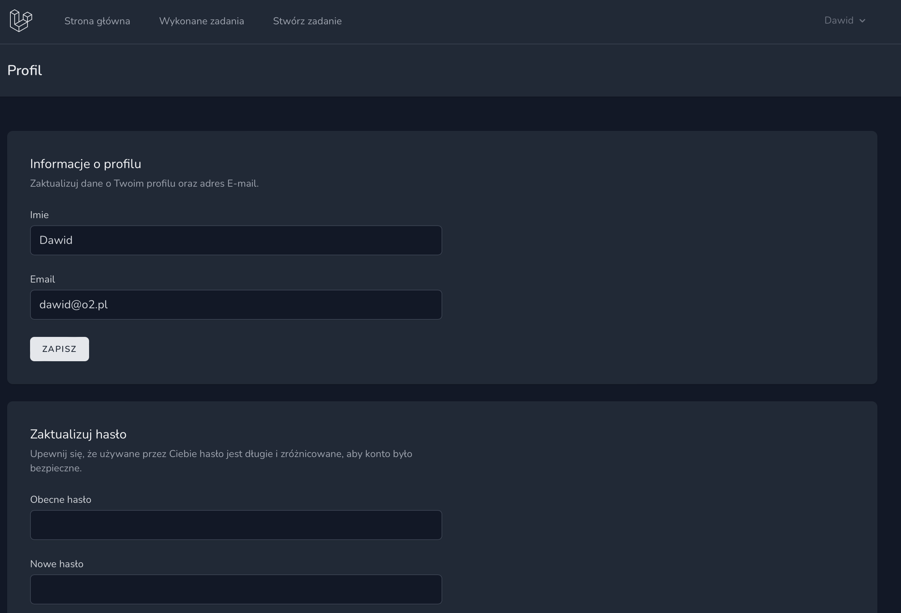

# Laravel-PHP-ToDoList

### About
This is a project made in Laravel framework using PHP programing language. ToDoList allows user to make his own tasks - set their title, deadline time etc. The website will help the user to manage his time.

### Needed tools
- PHP version 8.3.8
- Composer version 2.7.7
- mysql  Ver 14.14

### How to run
1. Clone the repository
2. Install php and composer if you don't have it
3. Install mysql server locally - you can use Docker
4. Copy .env.example file to .env file
5. Generate app key required by Laravel by using **`php artisan key:generate`**
6. Use **`php artisan migrate`** to make database structure in database server
7. Start the server using **`php artisan serve`**
8. (Optional) Install npm dependencies by using **`npm install`**
9. (Optional) Compile front-end resources by using **`npm run dev`**

### Functionalities
- Register
- Login
- Create a task
- Delete the task
- Edit the task
- Finish the task
- Check finished tasks
- Check task counter (finished and unfinished tasks)
- Change user name, e-mail and password

## Screenshots

### Registration site

### Login site

### Create task site

### Main panel site

### Finished tasks site

### Profile site (ability to change user data)

